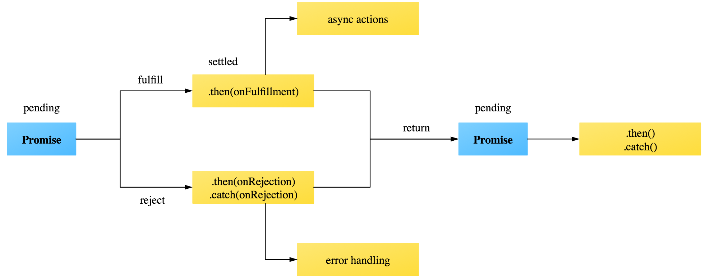


---
layout: page
title: About
permalink: /about/
---

# JavaScript
    <script type="text/javascript" src="./templates/jquery-1.12.4.js"></script>
## Basic Knowledge 
### Logic
break               //跳出循环
continue            //跳过本次循环
eval(variable);     // 执行或计算 字符串

&&      // and
|| 	    // or
### Debug
console.log(Variable)	          // print变量
console.log( typeof(Variable) )  // 类型
### Variable
###### var   {} 内部都有效
```
var AB = {first:"John", 
          lastName:"Doe",
          age:50,
          eyeColor:"blue"}
```    
let		只在{}中有效， { { } } 中无效
const  {}内有效，不可变

### Loop
##### For in
```
var obj = {a:1, b:2, c:3};
for (var prop in obj) {
  console.log( prop + "=" + obj[prop]);
}  //  a=1   b=2   c=3
```
###### for in 和 for of
```
var arr = ['a', 'b', 'c'];
for (let a in arr) { console.log(a); }
 	// 0 1 2 
for (let a of arr) { console.log(a); }
    // a b c 
```
## Operator 
### Spread syntax  展示运算符 
...obj 
###### function 
```
function myFunction(x, y, z) { }
var args = [0, 1, 2];
myFunction(...args); //myFunction(0,1,2)
```
###### Object
```
var obj1 = { foo: '1111', x: 42 };
var obj2 = { foo: '2222', y: 13 };
var clonedObj = { ...obj1 };
// Object { foo: "1111", x: 42 }

var mergedObj = { ...obj1, ...obj2 };
// Object { foo: "2222", x: 42, y: 13 }
```
## String 
### combine with variables (ES6)
```
customer=11111
var message = `Hello ${customer} want
to buy for`
// Hello 11111 want
// to buy for
```
### repeat()
    "foo ".repeat(3); //foo foo foo 
### split
str.split([separator[, limit]]) 

### replace()
string.replace(searchvalue, newvalue)

```
var str = "Mr Blue has a blue house and a blue car";
var res = str.replace(/blue/gi, "red");
// case-insensitive 不区分大小写
```

### charAt()

### charCodeAt()
Returns the Unicode of the character at the specified index
### concat()	
Joins two or more strings, and returns a new joined strings
### endsWith()
Checks whether a string ends with specified string/characters
### fromCharCode()	
Converts Unicode values to characters
### includes()	
Checks whether a string contains the specified string/characters
### indexOf()	
Returns the position of the first found occurrence of a specified value in a string
### lastIndexOf()	
Returns the position of the last found occurrence of a specified value in a string
### localeCompare()	
Compares two strings in the current locale
### match()	
Searches a string for a match against a regular expression, and returns the matches
### repeat()	
Returns a new string with a specified number of copies of an existing string
### replace() 
Searches a string for a specified value, or a regular expression, and returns a new string where the specified values are replaced
### search() 
Searches a string for a specified value, or regular expression, and returns the position of the match
### slice() 
Extracts a part of a string and returns a new string
### split() 
```
var str = "How are you doing today?";
var res = str.split(" ");
//  How,are,you,doing,today?
```
### startsWith() 
##### string.startsWith(searchvalue, start)
```
var str = "Hello world, welcome to the universe.";
var n = str.startsWith("Hello");
// true
```

### substr() 
#####  string.substr(start, end)
```
var str = "Hello world!";
var res = str.substr(1, 4);
The result of res will be:

ello
```
### substring() 
#####  string.substring(start, end)
```
var str = "Hello world!";
var res = str.substring(1, 4);
// ell
```
### toLocaleLowerCase() 
### toLocaleUpperCase() 
### toLowerCase() 
### toString() 

### toUpperCase() 

### trim() 
##### 删除开头结尾whitespace
```
var str = "       Hello World!        ";
alert(str.trim());
// Hello World!
```
### valueOf()	
    
    
    
    
    
## Array Properties and Methods
Fruits = ["Apple", "Banana", "Cherry", "Data枣", "Elderberry", "Fig无花果", "Grape", "Homeydew", "Iceberg", "Jackfruit", "Kiwi", "Lemon", "Mango", "Nectarine油桃", "Orange", "Pear", "Quince柑橘", "Raspberry", "Strawberry", "Tomato", "Ugli Fruit", "Victoria plum", "Watermelon", "X", "Yam山药", "Zucchini"];
### .length 
```     
Fruits.length   //26
```
### .forEach 
```
Fruits.forEach(function (item, index, array) { 
    console.log(item, index);
});    // 遍历整个Array
```
### Array.from()
从类数组或者迭代对象（iterable object）中创建一个新的数组实例。
Array.from(arrayLike[, mapFn[, thisArg]])
    arrayLike
    mapFn 
    thisArg
###### Object转化为Array
```
let arrayLike = {
'0': 'a',
'1': 'b',
'2': 'c',
length: 3	
};
let arr2 = Array.from(arrayLike); //[’a’, ‘b’, ‘c’]
```
##### 第二个参数作用
```
Array.from([1, 2, 3], (x) => x * x) 		
// [1, 4, 9]
Array.from({ length: 2 }, () => ‘jack’)	
// [’jack’, ‘jack’]
```
### Array.isArray()
返回true/false
### Array.of() 
创建一个有可变数量的参数的新的数组实例，无论参数有多少数量，而且可以是任意类型。
number转化为array
    
    Array.of(3, 11, 8) // [3,11,8]
## Array Methods Mutator 
会改变自身的值
### .copyWithin()
.copyWithin(target, start = 0, end)
target	//Default:0从该位置开始替换数据  
start	//Default:0      从该位置开始复制
end  	//Default: this.length 到该位置结束(不包括)   

```
[1, 2, 3, 4, 5].copyWithin(0, 3, 4)	// [4, 2, 3, 4, 5]
[1, 2, 3, 4, 5].copyWithin(0, -2, -1) 	// [4, 2, 3, 4, 5]
```
### .fill()
指定元素替换成固定值
arr.fill(value, start, end)
	value: 填充的值
	(start):起始索引default:0 
	(end): 终止索引default:this.length (不包括)
### .push()
##### 添加到末尾
    Fruits.push("Orange"); 
### .pop()
###### 删除末尾
    Fruits.pop();	
### .shift()
##### 删除头部
    Fruits.shift(); 
### .unshift()
##### 添加Strawberry到头部
    Fruits.unshift("Strawberry"); 
### .sort()
###### 数组的元素排序
    Fruits.sort();
### .reverse()
##### 数组中元素的位置颠倒
    Fruits.reverse();
### .splice()
在任意的位置 添加或删除 任意个元素
array.splice(start, deleteCount, item1, item2, ...)
	start: 修改的开始位置
	deleteCount: 要移除的数组元素的个数
	(item1, item2, ...) 要添加进数组的元素
	return: 被删除的元素

```
let removedItem = Fruits.splice(5,10);   //从Index5开始，删除10个 
console.log(Fruits);      // 0-4 , 15-25
console.log(removedItem); // 5-14
```
## Array Methods Accessor
不改变自身的值
### .slice()
抽取数组一段元素到新数组
.slice(begin,end)
	(begin): deault:0
	(end): defual:this.length
	
```
var shallowCopy = Fruits.slice();
```
### .concat()
返回一个由当前数组和其它若干个数组或者若干个非数组值组合而成的新数组。
### .includes() 
判断当前数组是否包含某指定的值，如果是返回 true，否则返回 false。
### .join()
连接所有数组元素组成一个字符串。
[,’a’, undefined, null].join(‘#’) // “#a##”
### .toSource() 
返回一个表示当前数组字面量的字符串。遮蔽了原型链上的 .toSource() 方法。
### .toString()
返回一个由所有数组元素组合而成的字符串。遮蔽了原型链上的 .toString() 方法。
[,’a’, undefined, null].toString() // “,a,,”
### .toLocaleString()
返回一个由所有数组元素组合而成的本地化后的字符串。遮蔽了原型链上的 .toLocaleString() 方法
### .indexOf()
返回数组中第一个与指定值相等的元素的索引，如果找不到这样的元素，则返回 -1
    let index = Fruits.indexOf("Banana");  // =2   找到Banana的索引

### .lastIndexOf()
返回数组中最后一个（从右边数第一个）与指定值相等的元素的索引，如果找不到这样的元素，则返回 -1





## Array Methods Iterator

### .forEach()
###### 做同一件事
```
let arr = ['a','b','c','d','e']
arr.forEach(function(item,index){
	console.log(index + ": " +item )
})
// 0: a  , 1: b , 2: c , 3: d , 4: e
```
### .map()
数组进行计算，返回新数组 
immutable method 不改变原数组

```
arr = ['a','b','c','d','e']
NewArr = arr.map(function(item,index){
	return index + ": " +item 
})
//  NewArr = ["0: a", "1: b", "2: c", "3: d", "4: e"]
```
### .reduce()
##### 前后项计算，得到新结果
```
arr = ['a','b','c','d','e']
result = arr.reduce(function(prev,next){
	return prev + next 
})
//  result = 'abcde'
```
### .entries() 
返回一个数组迭代器对象，该迭代器会包含所有数组元素的键值对

### .filter()
var newArray = arr.filter(callback[,  thisArg])
immutable methods 不改变原数组
##### 将所有在过滤函数中返回 true 的数组元素放进一个新数组中并返回
```
var words = ["spray", "limit", "elite", "exuberant", "destruction", "present"];
var longWords = words.filter(function(i){
    return i.length > 6;
});
// longWords: ["exuberant", "destruction", "present"]
``` 
### .every()
如果数组中的每个元素都满足测试函数，则返回 true，否则返回 false

```
[,’a’].every(x => x===’a’) // true
```
### .some()
###### 如果数组中至少有一个元素满足测试函数，则返回 true，否则返回 false
```
[,’a’].some(x => x !== ‘a’) // false
```
### .find() 
###### 找到第一个满足测试函数的元素并返回那个元素的值，如果找不到，则返回 undefined
```
[1, 4, -5, 10].find((n) => n < 0)	// -5
[1, 4, -5, 10].findIndex((n) => n < 0)	// 2
```
### .findIndex() 
找到第一个满足测试函数的元素并返回那个元素的索引，如果找不到，则返回 -1
### .keys() 
返回一个数组迭代器对象，该迭代器会包含所有数组元素的键
### .reduceRight()
从右到左为每个数组元素执行一次回调函数，并把上次回调函数的返回值放在一个暂存器中传给下次回调函数，并返回最后一次回调函数的返回值
### .values() 
返回一个数组迭代器对象，该迭代器会包含所有数组元素的值

## Function
### Default value
```
function log(x, y = 'World') {
   console.log(x, y);
}  
log(1);  	// 1 "World"
log(1,1);	// 1 1
```
### Return 简写=> 
没有this
没有call()、apply()、bind()

```
var sum = (num1, num2) => num1 + num2;
等同于
var sum = function(num1, num2) {
    return num1 + num2;
};
```
### Function.caller 
获取调用函数的具体对象。
### Function.length
获取函数的接收参数个数。
### Function.name
获取函数的名称。
### Function.displayName 
获取函数的display name。
### Function.prototype.apply()
在一个对象的上下文中应用另一个对象的方法；参数能够以数组形式传入。
### Function.prototype.bind()
fun.bind(thisArg[, arg1[, arg2[, ...]]])
#### 第一个参数作为 this
```
this.x = 9; 
var module = {
  x: 81,
  getX: function() { return this.x; }
};

module.getX(); // 返回 81

var retrieveX = module.getX;
retrieveX(); // 返回 9, 在这种情况下，"this"指向全局作用域

// 创建一个新函数，将"this"绑定到module对象
// 新手可能会被全局的x变量和module里的属性x所迷惑
var boundGetX = retrieveX.bind(module);
boundGetX(); // 返回 81
```
#### 第二个 增加预设 Argument
### Function.prototype.call()
在一个对象的上下文中应用另一个对象的方法；参数能够以列表形式传入
### Function.prototype.isGenerator() 
若函数对象为generator，返回true，反之返回 false
### Function.prototype.toSource() 
获取函数的实现源码的字符串。 覆盖了 .toSource 方法
### Function.prototype.toString()
获取函数的实现源码的字符串。覆盖了 .toString 方法

## Object
### Object.assign()
##### 通过复制一个或多个对象来创建一个新的对象
```
var target = { a: 1 };
var source1 = { b: 2 };
var source2 = { c: 3 };
Object.assign(target, source1, source2);  
// target＝{a:1, b:2, c:3}
```
### Object.create()
指定原型对象和属性来创建一个新的对象
### Object.defineProperty()
给对象添加一个属性并指定该属性的配置
### Object.defineProperties()
给对象添加多个属性并分别指定它们的配置
### Object.keys()
##### 返回数组 键值
```
var obj = { foo: "bar", baz: 42 };
Object.keys(obj);  	// ["foo", "baz"]
```
### .values()
返回数组 数值
var obj = { foo: "bar", baz: 42 };
Object.values(obj)		// ["bar", 42]
### Object.entries()
返回数组 键值和数值
var obj = { foo: "bar", baz: 42 };
Object.entries(obj)		// [ ["foo", "bar"], ["baz", 42] ]

### Object.freeze()
冻结对象：使对象不可删除或修改它的属性。
### Object.getOwnPropertyDescriptor()
返回对象指定的属性配置。
### Object.getOwnPropertyNames()
返回一个数组，它包含了指定对象所有的可枚举或不可枚举的属性名。
### Object.getOwnPropertySymbols()
返回一个数组，它包含了指定对象自身所有的符号属性。
### Object.getPrototypeOf()
返回指定对象的原型对象。
### Object.is()
判断两个值是否严格相等 类似===运算符，但+0不等于-0，NaN等于自己
### Object.is('foo', 'foo')	//true
Object.is({}, {})		//false

### Object.isExtensible()
判断对象是否可扩展。
### Object.isFrozen()
判断对象是否已经冻结。
### Object.isSealed()
判断对象是否已经密封。

### Object.preventExtensions()
阻止对象扩展。
### Object.seal()
密封对象以防删除。
### Object.setPrototypeOf()
设置对象的原型。


## Object Prototype   
### .constructor
特定的函数，用于创建一个对象的原型。
方法
### defineGetter
`.__defineSetter__()`   
关联一个函数到一个属性。访问该函数时，执行该函数并返回其返回值。
### defineSetter
` .__defineSetter__()  `
关联一个函数到一个属性。设置该函数时，执行该修改属性的函数。
### lookupGetter
```
.__lookupGetter__()  
返回使用 __defineGetter__ 定义的方法函数 。
```
### defineSetter
```
 .__lookupSetter__()
返回使用 __defineSetter__ 定义的方法函数。
```
### .hasOwnProperty()
返回一个布尔值 ，表示某个对象是否含有指定的属性，而且此属性非原型链继承的。
### .isPrototypeOf()
返回一个布尔值，表示指定的对象是否在本对象的原型链中。
### .propertyIsEnumerable()
判断指定属性是否可枚举，内部属性设置参见 ECMAScript DontEnum attribute 。
### .toSource() 
返回字符串表示此对象的源代码形式，可以使用此字符串生成一个新的相同的对象。
### .toLocaleString()
直接调用 toString()方法。
### .toString()
返回对象的字符串表示。
### .unwatch() 
移除对象某个属性的监听。
### .valueOf()
返回指定对象的原始值。
### .watch() 
给对象的某个属性增加监听。

## Json 
### JSON.stringify
Javascript 转 JSON
JSON.stringify(value [, replacer[, space] ] )
>replacer: 如果是函数，每个字符都处理
>       如果是数组，选择key与之匹配的 
>space: 锁进空白字符串 

```
JSON.stringify(foo, ['week', 'month']);  
// '{"week":45,"month":7}'
//  只保留“week”和“month”属性值
```
### JSON.parse()
JSON 转 Javascript
## Class
### 属性  
###### Class内部只有静态方法，没静态属性 ES6
```
class Foo {  }
Foo.prop = 1;
Foo.prop 		// 1
方法 
let person = new class {
  constructor(name) {
    this.name = name;
  }
  sayName() {
    console.log(this.name);
  }
}('Great');
person.sayName();  // Great
```
### 继承
class ColorPoint extends Point {}
super(x, y); // 调用父类的 (x, y)
super.toString(); // 调用父类的toString()
### prototype
```
子类__proto__ ＝ 父类
Object.setPrototypeOf(B.prototype, A.prototype);
// B的实例继承A的实例
Object.setPrototypeOf(B, A);
// B继承A的静态属性
```
原生构造函数的继承
Boolean()       Number()
String()        Array()
Date()          Function()
RegExp()        Error()
Object()
### Get 和 Set
```
class MyClass {
  get prop() {
    return 'call_only';
  }
  set prop(value) {
    console.log('Equal_Value: '+value);
  }
}
let a= new MyClass();
a.prop = 123;    // Equal_Value: 123
c = a.prop       // 'call_only'
```
### static 	 直接调用，不能被实例  
```
class Foo {
  static classMethod() {
    return 'hello';
  }
}
Foo.classMethod() // 'hello'
```
## Control abstraction Objects
### Promise

.then(onFulfilled [, onRejected] );
    onFulfilled: 完成function 
    onRejected: 拒绝function
.catch()


### Generator


## Ajax

```
<script>
function loadXMLDoc()
{
	let xmlhttp;
	if (window.XMLHttpRequest)
	{
		// IE7+, Firefox, Chrome, Opera, Safari 浏览器执行代码
		xmlhttp=new XMLHttpRequest();
	}
	else
	{
		// IE6, IE5 浏览器执行代码
		xmlhttp=new ActiveXObject("Microsoft.XMLHTTP");
	}
	xmlhttp.onreadystatechange=function()
	{
		if (xmlhttp.readyState==4 && xmlhttp.status==200)
		{
			document.getElementById("myDiv").innerHTML=xmlhttp.responseText;
		}
	}
	xmlhttp.open("GET","http://fontawesome.io/cheatsheet/",true);
	xmlhttp.send();
}
</script>

<button type="button" onclick="loadXMLDoc()">请求数据</button>
<div id="myDiv"></div>
```
## Web API
new Date().toLocaleTimeString()     // 现在时间 12:00:00 (12点)


onchange
onclick


.Event

### localStorage
```
const prevState = localStorage.getItem('flatrisState');
const initialState = prevState ? { game: JSON.parse(prevState) } : undefined;
localStorage.setItem('flatrisState', JSON.stringify(store.getState().game));
```




## Element
### .innerHTML
子元素
### .outerHTML
```
<tr id="myRow"><td>A</td><td>B</td></tr>
row.innerHTML;    
//  <td>A</td><td>B</td> 
row.outerHTML;   
//  <tr id="myRow"><td>A</td><td>B</td></tr>
```



